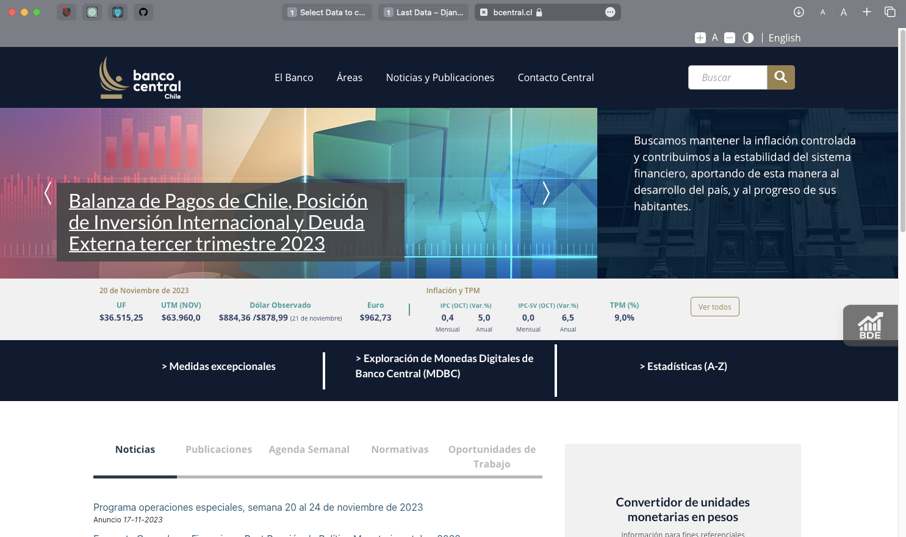
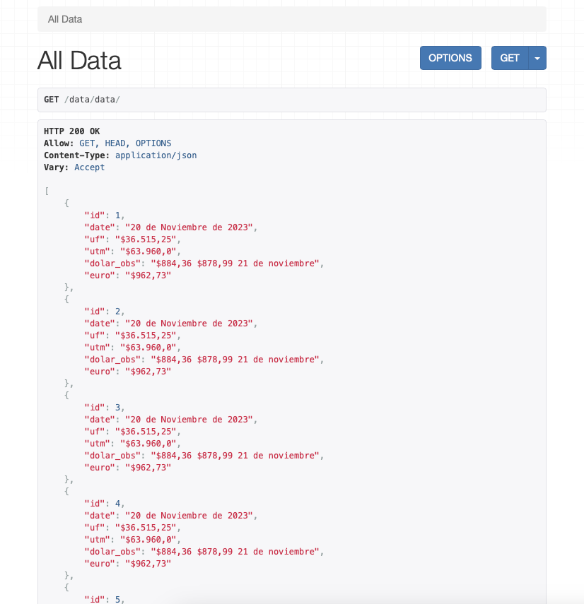
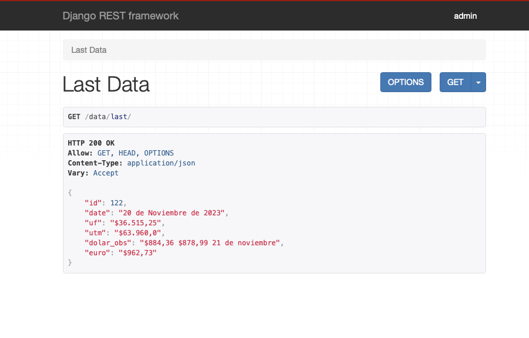

# datasurback

- tecnologias
  - python
  - django
  - django rest framework
  - beautifulsoup4

# Pasos
- por medio de beatifulsoup obtenemos datos de la pagina web del banco central de chile 
https://www.bcentral.cl/inicio donde se encuentran los valores del dolar, euro y uf entre otros 

- luego de identificar los datos que necesitamos, los guardamos en un modelo anteriormente creado 
en los models de django
- ya teniendo los datos en el modelo, creamos una vista usando django rest framework APIView para todos los
que queremos exponer hacia el front

- teniendo estos dos servicios creados podemos consumirlos desde el front, en este caso se uso react